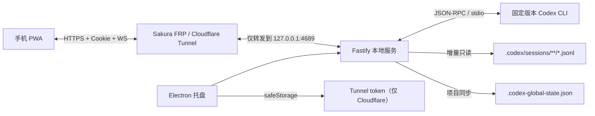

# Codex Control

## 项目简介

Codex Control 是一个 Windows 托盘应用和手机 PWA，让你从手机安全地访问并控制本机 Codex：切换项目和会话、创建对话、选择模型与推理强度、查看实时回复、处理审批，以及停止任务。它通过 Sakura FRP 或 Cloudflare Named Tunnel 将本机服务以 HTTPS 暴露给已配对的个人设备。

碎碎念：鄙人使用的鸿蒙系统让我在使用手机控codex的路途上吃尽了苦头，chatgpt手机app无法下载、市面流传的app要不收费要不功能不全（很多都无法切换会话模型，或者无法同步桌面任务历史会话），由此催生了此项目。同时感谢伟大的AI时代让我不到一上午就能完成这个项目。

如有Bug欢迎提issue，看到会尽快修复（如果有能力）


## 端到端使用

### 1. 安装并启动

1. 从 [GitHub Releases](https://github.com/g826796047/Codex-Control/releases) 下载最新的 Windows x64 安装包并完成安装。
2. 从开始菜单启动 **Codex Control**；它会以托盘程序方式运行。
3. 首次启动时，应用会校验本机 Codex CLI；不存在时会下载固定版本。请保持网络可用，并使用自己的 Codex 账号完成登录。

Windows 安装包暂未代码签名，SmartScreen 可能显示“未知发布者”提示。请仅从本仓库 Release 下载。

### 2. 配置手机访问地址

应用本地服务仅监听 `127.0.0.1:4689`。请选择一种方式提供自己的 HTTPS 公网地址：

**Sakura FRP**

1. 在 Sakura FRP 创建 HTTPS 隧道，将公网地址转发到 `127.0.0.1:4689`。
2. 在托盘菜单中选择“配置公网访问”，选择“Sakura FRP”。
3. 填写完整的 HTTPS 公网地址并保存。

**Cloudflare Named Tunnel**

1. 在 Cloudflare Zero Trust 创建 Named Tunnel 和公开主机名。
2. 将服务目标设置为 `http://127.0.0.1:4689`。
3. 在托盘菜单中选择“配置 Cloudflare Tunnel”，填写 HTTPS 地址和 connector token。

必须使用 HTTPS；纯 HTTP 无法满足设备 Cookie 的 `Secure` 要求。

### 3. 配对手机

1. 在 PC 托盘菜单点击“添加设备”。
2. 用手机浏览器扫描二维码，或输入显示的 9 位一次性配对码。
3. 配对成功后，手机会获得长期设备 Cookie；以后直接打开公网地址即可进入工作台。

配对入口仅开放 5 分钟，配对码和二维码 URL 仅限本人使用。设备可随时在 PC 托盘中撤销。

### 4. 在手机上控制 Codex

1. 选择项目和会话，或创建新对话。
2. 选择模型与推理强度，发送任务。
3. 实时查看回复、命令输出和文件变更；需要时在页面上批准或拒绝审批请求。
4. 使用停止按钮中断由网页发起的任务。

桌面端正在运行的任务会在约 1–2 秒内以只读方式同步到手机。网页新建任务由独立 app-server 执行，因此不会实时显示在官方 Codex 桌面 UI 中。

> [!WARNING]
> 这是一个用于控制本机 Codex 的个人远程访问工具。请不要将配对码、设备 Cookie、Tunnel token、诊断导出文件或包含本机路径的日志发布到 Issue、截图或公开仓库。

## 架构



- `apps/desktop`：Electron 托盘、二维码、设备撤销、开机启动、`safeStorage` 和诊断导出。
- `apps/server`：Fastify API、WebSocket 事件、Codex JSON-RPC、session 增量同步、鉴权和 Tunnel 管理。
- `apps/web`：React/Vite 手机 PWA。
- `packages/shared`：前后端共享的公开接口类型。

## 开发

环境要求：Windows x64、Node.js 22.13+、pnpm 11。

```powershell
pnpm install
pnpm electron:install
pnpm build
pnpm dev
```

Electron 43 将运行时下载拆成了显式命令，因此首次开发需要执行 `pnpm electron:install`。如果所在网络无法直连 Electron 下载源，可配置组织允许的 Electron mirror 后再执行该命令。

常用检查：

```powershell
pnpm typecheck
pnpm test
pnpm test:e2e
pnpm build
```

`pnpm test:e2e` 会用 iPhone 15 和 Pixel 7 视口验证配对与移动工作台。当前 Codex 执行环境的企业浏览器策略禁止自动访问 localhost，因此此命令需要在普通本机终端中运行。

## Cloudflare Named Tunnel

1. 在 Cloudflare Zero Trust 中创建 Named Tunnel。
2. 添加公开主机名，例如 `codex.example.com`。
3. Service 选择 HTTP，目标填写 `http://127.0.0.1:4689`。
4. 从 Tunnel 安装命令中复制 connector token。
5. 在托盘菜单选择“配置 Cloudflare Tunnel”，填写 `https://codex.example.com` 和 token。

不需要启用邮箱 Access。应用自己的设备配对层会在任何 Codex 数据返回前完成鉴权。Tunnel token 使用 Electron `safeStorage` 加密保存，启动 `cloudflared` 时只通过 `TUNNEL_TOKEN` 环境变量传递。

## Sakura FRP

Sakura FRP 由用户自行运行，Codex Control 不接管 `frpc` 进程。创建一个 HTTPS 隧道，将公网地址转发到本机 `127.0.0.1:4689`，然后在托盘菜单“配置公网访问”中选择“Sakura FRP”，填写公网 HTTPS 地址并保存。应用会将该地址用于二维码、Origin 校验和手机 PWA，不会上传 Sakura FRP 密钥。

Sakura FRP 必须提供 HTTPS；纯 HTTP 地址无法满足生产 Cookie 的 `Secure` 要求。

## 首次使用

1. 首次启动会查找并校验本机已有的 Codex CLI；找不到时才下载并校验：
   - Codex CLI `0.146.0-alpha.3`，SHA-256 `6aeaca6a797ed7e5d8163d750e10947f098ceb0f1faff02fedaef487602c2fe2`。
   - cloudflared `2026.7.3`，SHA-256 `8635da433b6df8194746e88ed9d2589566c20e38bfc2a80e431a348b7c765841`。
2. 配置 Sakura FRP 或 Cloudflare Tunnel。
3. 在托盘点击“添加设备”。
4. 手机扫描二维码，或输入 9 位一次性配对码。
5. 配对成功后手机获得一年有效的设备 Cookie；可随时在 PC 托盘撤销。

二维码中的 256-bit 配对令牌位于 URL fragment，不会进入 HTTP 请求、Tunnel 日志或服务端访问日志。配对入口只开放 5 分钟，单来源最多尝试 8 次。

## 控制与同步语义

- 手机创建的任务和从手机接管的空闲会话由独立 app-server 控制，支持逐 token 回复、审批和停止。由于官方 Codex 桌面应用并不订阅这个独立 app-server 的实时通知，这些任务不会实时显示在官方桌面 UI 中；它们仍会写入本地 Codex 会话数据。
- PC 桌面端正在运行的任务通过 session JSONL 在约 1–2 秒内只读同步；结束后页面会显示“可从手机继续”。
- 同一会话只允许一个桥接任务运行。
- app-server 崩溃后指数退避重启；未确认结果的写请求不会自动重发。
- session 读取支持桌面并发写入、半行、截断/轮转、未知记录和语义去重。
- 不读取 PATH 中的旧版 Codex；运行时必须通过固定版本校验。

## HTTP 与 WebSocket 接口

- `POST /api/auth/pair`
- `GET /api/bootstrap`
- `GET /api/threads/:id`
- `POST /api/threads`
- `POST /api/threads/:id/turns`
- `POST /api/threads/:id/interrupt`
- `POST /api/approvals/:id/resolve`
- `WS /api/events?after=<sequence>`

除配对状态和临时配对提交外，所有接口都要求有效设备 Cookie。写操作额外校验 Origin 与 `X-CSRF-Token`。WebSocket 使用递增序号恢复事件；序号过期时客户端重新获取快照。

## 打包

```powershell
pnpm package:win
```

产物输出到 `release/`，目标为 Windows x64 NSIS。卸载默认保留设备与 Tunnel 配置，避免误删本机凭据；如需彻底清除，可手动删除 `%APPDATA%\\Codex Control`。

安装包当前未进行代码签名，Windows SmartScreen 可能显示“未知发布者”提示。请只从本仓库的 Release 下载，并在发布时提供校验和。

## 安全报告

请不要通过公开 Issue 报告安全漏洞。请使用 GitHub 的 [Private vulnerability reporting](https://github.com/g826796047/Codex-Control/security/advisories/new)；如果该功能尚未启用，请先在仓库 **Settings → Code security and analysis** 中开启它。

## 许可证与第三方组件

本项目以 [MIT License](LICENSE) 发布。Codex CLI、Electron、cloudflared 及其他依赖仍分别遵循其自身许可证；MIT 许可证不改变这些组件的许可条款。

## 首版边界

- 单用户、多个人设备。
- Windows x64 和现代手机 Chrome/Safari。
- PC 必须在线且托盘程序正在运行。
- 不包含文件上传、图片附件、多人角色、项目共享或任意文件系统浏览。
